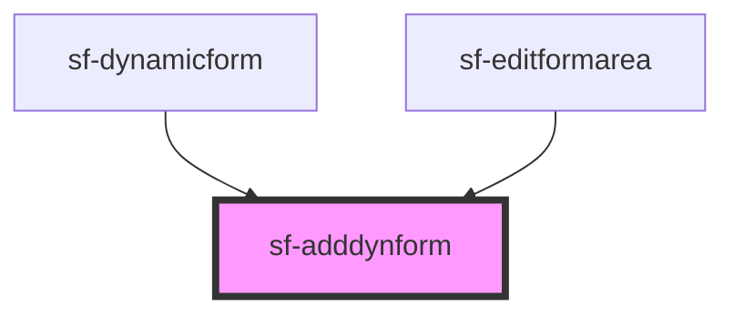

# sf-adddynform

<!-- Auto Generated Below -->

## Events

| Event       | Description | Type                |
| ----------- | ----------- | ------------------- |
| `isClicked` |             | `CustomEvent<void>` |

## Dependencies

### Used by

 - [sf-dynamicform](../sf-dynamicform)
 - [sf-editformarea](../sf-editformarea)

### Graph

----------------------------------------------

*Built with [StencilJS](https://stenciljs.com/)*
