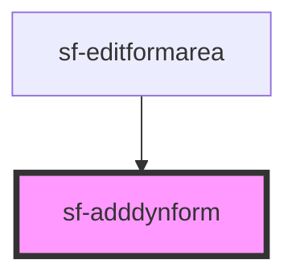

# sf-adddynform

<!-- Auto Generated Below -->

## Events

| Event        | Description | Type               |
| ------------ | ----------- | ------------------ |
| `addDynForm` |             | `CustomEvent<any>` |

## Dependencies

### Used by

 - [sf-editformarea](../sf-editformarea)

### Graph

----------------------------------------------

*Built with [StencilJS](https://stenciljs.com/)*
