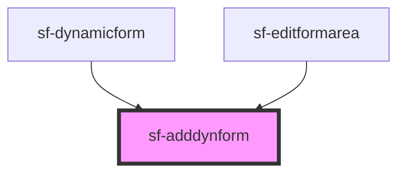

# sf-adddynform

<!-- Auto Generated Below -->

## Properties

| Property | Attribute | Description | Type     | Default     |
| -------- | --------- | ----------- | -------- | ----------- |
| `id`     | `id`      |             | `string` | `undefined` |
| `value`  | `value`   |             | `string` | `undefined` |

## Events

| Event       | Description | Type                |
| ----------- | ----------- | ------------------- |
| `isClicked` |             | `CustomEvent<void>` |

## Dependencies

### Used by

 - [sf-dynamicform](../sf-dynamicform)
 - [sf-editformarea](../sf-editformarea)

### Graph

----------------------------------------------

*Built with [StencilJS](https://stenciljs.com/)*
