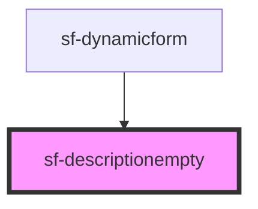

# sf-descriptionempty

<!-- Auto Generated Below -->

## Events

| Event              | Description | Type                  |
| ------------------ | ----------- | --------------------- |
| `descriptionInput` |             | `CustomEvent<string>` |

## Dependencies

### Used by

 - [sf-dynamicform](../sf-dynamicform)

### Graph

----------------------------------------------

*Built with [StencilJS](https://stenciljs.com/)*
