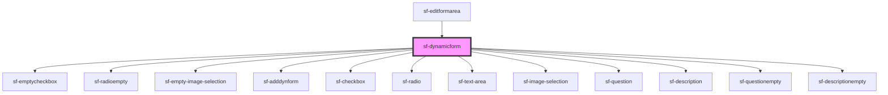

# sf-dynamicform

<!-- Auto Generated Below -->

## Properties

| Property      | Attribute       | Description | Type                                                  | Default         |
| ------------- | --------------- | ----------- | ----------------------------------------------------- | --------------- |
| `description` | `description`   |             | `string`                                              | `undefined`     |
| `isOpen`      | `is-open`       |             | `boolean`                                             | `undefined`     |
| `question`    | `question`      |             | `string`                                              | `'Deine Frage'` |
| `radio`       | `radio`         |             | `string`                                              | `undefined`     |
| `radioIdNmbr` | `radio-id-nmbr` |             | `number`                                              | `0`             |
| `result`      | `result`        |             | `CheckBoxDef[] \| ImageDef[] \| RadioDef[] \| string` | `undefined`     |

## Dependencies

### Used by

 - [sf-editformarea](../sf-editformarea)

### Depends on

- [sf-emptycheckbox](../sf-emptycheckbox)
- [sf-radioempty](../sf-radioempty)
- [sf-empty-image-selection](../sf-empty-image-selection)
- [sf-adddynform](../sf-adddynform)
- [sf-checkbox](../sf-checkbox)
- [sf-radio](../sf-radio)
- [sf-text-area](../sf-text-area)
- [sf-image-selection](../sf-image-selection)
- [sf-question](../sf-question)
- [sf-description](../sf-description)
- [sf-questionempty](../sf-questionempty)
- [sf-descriptionempty](../sf-descriptionempty)

### Graph

----------------------------------------------

*Built with [StencilJS](https://stenciljs.com/)*
