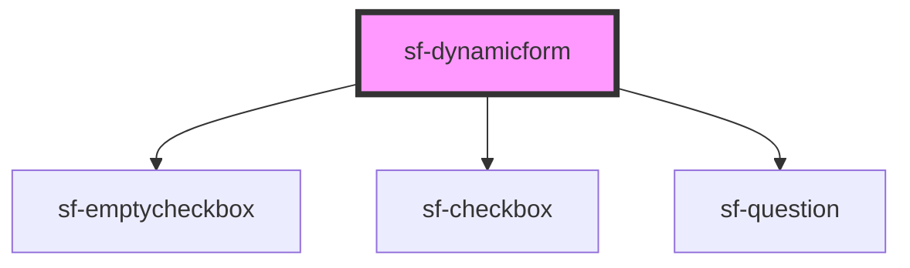

# sf-dynamicform

<!-- Auto Generated Below -->

## Properties

| Property | Attribute | Description | Type     | Default     |
| -------- | --------- | ----------- | -------- | ----------- |
| `answer` | `answer`  |             | `string` | `undefined` |

## Dependencies

### Depends on

- [sf-emptycheckbox](../sf-emptycheckbox)
- [sf-checkbox](../sf-checkbox)
- [sf-question](../sf-question)

### Graph

---

_Built with [StencilJS](https://stenciljs.com/)_
