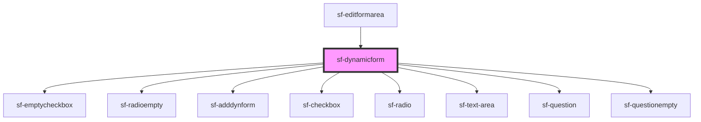

# sf-dynamicform

<!-- Auto Generated Below -->

## Properties

| Property      | Attribute       | Description | Type     | Default |
| ------------- | --------------- | ----------- | -------- | ------- |
| `radioIdNmbr` | `radio-id-nmbr` |             | `number` | `0`     |

## Dependencies

### Used by

 - [sf-editformarea](../sf-editformarea)

### Depends on

- [sf-emptycheckbox](../sf-emptycheckbox)
- [sf-radioempty](../sf-radioempty)
- [sf-adddynform](../sf-adddynform)
- [sf-checkbox](../sf-checkbox)
- [sf-radio](../sf-radio)
- [sf-text-area](../sf-text-area)
- [sf-question](../sf-question)
- [sf-questionempty](../sf-questionempty)

### Graph

----------------------------------------------

*Built with [StencilJS](https://stenciljs.com/)*
