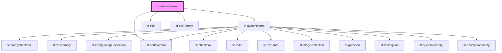

# sf-editformarea

<!-- Auto Generated Below -->

## Properties

| Property | Attribute | Description | Type      | Default           |
| -------- | --------- | ----------- | --------- | ----------------- |
| `ftitle` | `ftitle`  |             | `string`  | `'Deine Umfrage'` |
| `isOpen` | `is-open` |             | `boolean` | `false`           |

## Methods

### `getFormElement() => Promise<void>`

#### Returns

Type: `Promise<void>`

## Dependencies

### Depends on

- [sf-dynamicform](../sf-dynamicform)
- [sf-title](../sf-title)
- [sf-title-empty](../sf-title-empty)
- [sf-adddynform](../sf-adddynform)

### Graph

----------------------------------------------

*Built with [StencilJS](https://stenciljs.com/)*
