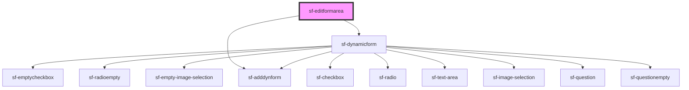

# sf-editformarea

<!-- Auto Generated Below -->

## Methods

### `getFormElement() => Promise<void>`

#### Returns

Type: `Promise<void>`

## Dependencies

### Depends on

- [sf-dynamicform](../sf-dynamicform)
- [sf-adddynform](../sf-adddynform)

### Graph

----------------------------------------------

*Built with [StencilJS](https://stenciljs.com/)*
