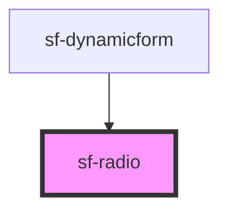

# sf-radio

<!-- Auto Generated Below -->

## Properties

| Property    | Attribute    | Description | Type     | Default     |
| ----------- | ------------ | ----------- | -------- | ----------- |
| `radioId`   | `radio-id`   |             | `string` | `undefined` |
| `radioName` | `radio-name` |             | `string` | `undefined` |
| `value`     | `value`      |             | `string` | `undefined` |

## Dependencies

### Used by

 - [sf-dynamicform](../sf-dynamicform)

### Graph

----------------------------------------------

*Built with [StencilJS](https://stenciljs.com/)*
