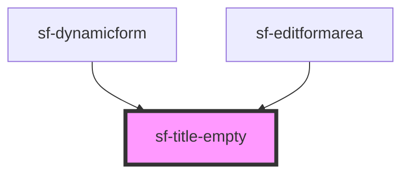

# sf-title-empty

<!-- Auto Generated Below -->

## Events

| Event        | Description | Type                  |
| ------------ | ----------- | --------------------- |
| `titleInput` |             | `CustomEvent<string>` |

## Dependencies

### Used by

 - [sf-dynamicform](../sf-dynamicform)
 - [sf-editformarea](../sf-editformarea)

### Graph

----------------------------------------------

*Built with [StencilJS](https://stenciljs.com/)*
