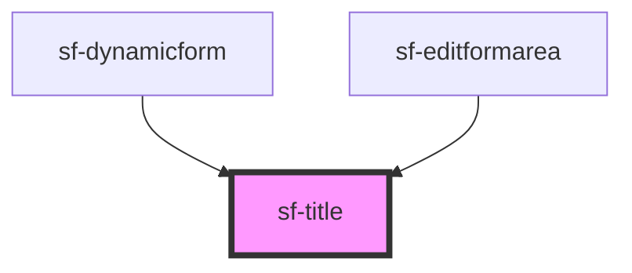

# sf-title

<!-- Auto Generated Below -->

## Properties

| Property | Attribute | Description | Type     | Default     |
| -------- | --------- | ----------- | -------- | ----------- |
| `tvalue` | `tvalue`  |             | `string` | `undefined` |

## Dependencies

### Used by

 - [sf-dynamicform](../sf-dynamicform)
 - [sf-editformarea](../sf-editformarea)

### Graph

----------------------------------------------

*Built with [StencilJS](https://stenciljs.com/)*
